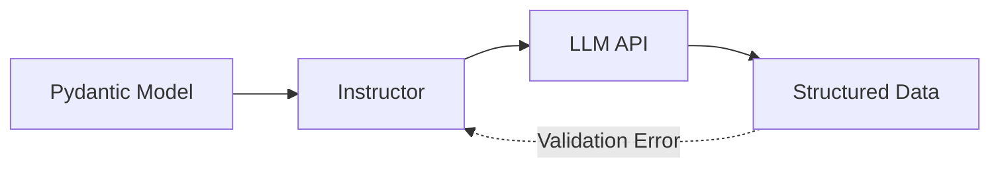
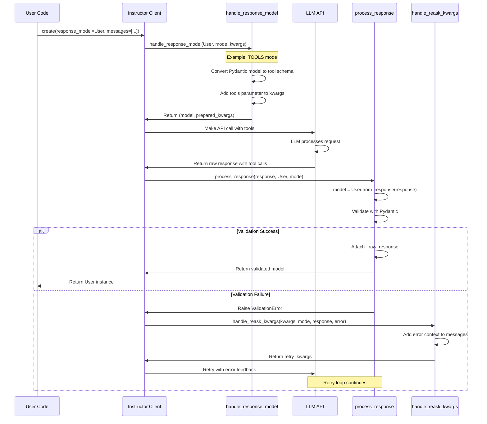

# Instructor Architecture

This document explains how Instructor works internally and how it integrates with different LLM providers.

## Overview

Instructor is a Python library that provides a unified interface for extracting structured data from Large Language Models (LLMs). It supports 40+ different modes across 15+ providers, handling the complexity of different APIs while providing a consistent developer experience.

## Core Flow



## Key Components

### 1. Client Initialization and Patching

Instructor works by patching existing LLM provider clients:

```python
import instructor
from openai import OpenAI

# Instructor patches the client to add structured output capabilities
client = instructor.from_openai(OpenAI())
```

The patching process:
- Preserves all original client functionality
- Adds `response_model` parameter to completion methods
- Intercepts responses for structured data extraction
- Maintains compatibility with provider updates

### 2. Response Model Handling (`handle_response_model`)

This is the pre-processing step that prepares requests for different providers:

**Responsibilities:**
- Converts Pydantic models to provider-specific schemas
- Adds tool/function definitions for providers that support them
- Injects system prompts for JSON-mode providers
- Handles special cases like parallel tool calls

**Mode Categories:**
- **Tool Modes** (OpenAI, Anthropic, Gemini, etc.): Convert models to function/tool schemas
- **JSON Modes** (Anthropic JSON, Vertex JSON, etc.): Add system prompts with schemas
- **Parallel Modes**: Wrap models to handle multiple concurrent calls
- **Special Modes**: Provider-specific formats (MD_JSON, JSON_SCHEMA, etc.)

### 3. Response Processing (`process_response`)

The core dispatcher that transforms raw LLM responses into structured data:

**Processing Flow:**
1. **Type Detection**: Identifies special model types (Iterable, Partial, Parallel, Adapter)
2. **Mode-Specific Parsing**: Uses provider-specific parsers
3. **Validation**: Validates against Pydantic models
4. **Error Handling**: Captures validation errors for retry

**Special Response Types:**
- **IterableBase**: Extracts multiple objects from a single response
- **PartialBase**: Handles streaming/incomplete objects
- **ParallelBase**: Manages multiple tool calls in parallel
- **AdapterBase**: Simple type conversions (str, int, etc.)

### 4. Error Recovery (`handle_reask_kwargs`)

When validation fails, this system prepares retry requests:

**Reask Strategies by Provider:**

**OpenAI/Compatible:**
- Adds assistant message with failed attempt
- Includes user message with validation error details
- Preserves original tool definitions

**Anthropic:**
- Includes previous tool_use blocks
- Formats errors in Anthropic's expected format
- Updates system messages for JSON modes

**Google/Vertex:**
- Maintains conversation context
- Adds error as user message
- Preserves function call history

### 5. Provider-Specific Utilities

Each provider has dedicated utility modules:

```
instructor/utils/
├── openai.py      # OpenAI, Azure, compatible providers
├── anthropic.py   # Claude models
├── google.py      # Gemini, Vertex AI
├── mistral.py     # Mistral AI
├── cohere.py      # Cohere
└── ...            # 15+ providers total
```

Each module exports:
- `handle_*` functions for request preparation
- `reask_*` functions for error recovery
- Provider-specific schema generators
- Response parsing logic

## Mode System

Instructor uses a Mode enum to identify provider/format combinations:

```python
class Mode(enum.Enum):
    # OpenAI modes
    TOOLS = "tool_call"
    PARALLEL_TOOLS = "parallel_tool_call"
    JSON = "json_mode"
    
    # Anthropic modes
    ANTHROPIC_TOOLS = "anthropic_tools"
    ANTHROPIC_JSON = "anthropic_json"
    
    # ... 40+ modes total
```

Each mode determines:
- How to format the request
- How to parse the response
- How to handle errors
- What features are available

## Request Flow Timeline

The following timeline diagram shows the core request flow through Instructor:



## Request Flow Detail

### Example: User Perspective

Here's what users actually write:

```python
import instructor
from pydantic import BaseModel

# Define the structure they want
class User(BaseModel):
    name: str
    age: int

# Create a client for any provider
client = instructor.from_provider("openai/gpt-4o-mini")

# Extract structured data with one call
user = client.chat.completions.create(
    response_model=User,
    messages=[{"role": "user", "content": "John is 25 years old"}],
)

print(user)  # User(name='John', age=25)
```

### What Happens Under the Hood

When the user calls `create()`, here's the internal flow:

1. **Request Preparation** (`handle_response_model`):
   - Converts the `User` Pydantic model into provider-specific format
   - For OpenAI: Creates a tool/function schema
   - For Anthropic: Creates a tool schema or JSON system prompt
   - Adds these to the request kwargs

2. **API Call**:
   - Patched client sends request to LLM provider
   - Includes generated schemas/prompts
   - Provider returns response in their format

3. **Response Processing** (`process_response`):
   - Extracts structured data from provider's response format
   - Validates against the Pydantic model
   - Returns typed, validated object

4. **Automatic Retry** (if validation fails):
   - `handle_reask_kwargs` formats the error
   - Sends back to LLM with error context
   - Repeats until valid or max_retries reached

## Performance Optimizations

1. **Dictionary Operations**: Optimized lookups and shallow copying
2. **Mode Dispatch**: O(1) dictionary-based routing
3. **Streaming Support**: Efficient handling of partial responses
4. **Caching**: Schema generation results cached where possible

## Extensibility

### Adding a New Provider

1. Create utility module in `instructor/utils/`
2. Implement handler functions:
   - `handle_provider_tools/json`
   - `reask_provider_tools/json`
3. Add modes to `Mode` enum
4. Update `process_response.py` dictionaries
5. Create client factory in `instructor/client_provider.py`

### Adding a New Feature

1. Extend DSL if needed (new base class)
2. Update `process_response` to handle new type
3. Add mode-specific handling in provider utils
4. Update documentation and examples

## Best Practices

1. **Mode Selection**: Choose the most specific mode for your provider
2. **Error Handling**: Use max_retries for automatic recovery
3. **Streaming**: Use Partial/Iterable for large responses
4. **Validation**: Leverage Pydantic validators for business logic
5. **Performance**: Reuse client instances, batch when possible

This architecture enables Instructor to provide a consistent interface across different LLM providers while handling their specific implementation details behind the scenes. The modular design allows for easy addition of new providers and features while maintaining backward compatibility.