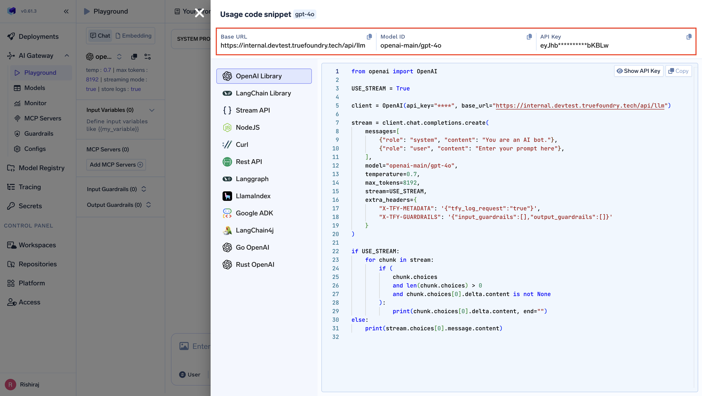

This guide provides instructions for integrating Instructor with the [TrueFoundry AI Gateway](https://www.truefoundry.com/ai-gateway) for structured data extraction from LLMs.

## What is TrueFoundry?

TrueFoundry provides an enterprise-ready [AI Gateway](https://www.truefoundry.com/ai-gateway) and integrates seamlessly with libraries like instructor, providing enterprise-grade AI features including cost tracking, security guardrails, and access controls.

## Prerequisites

Before integrating Instructor with TrueFoundry, ensure you have:

1. **TrueFoundry Account**: Create a [TrueFoundry account](https://www.truefoundry.com/register) with at least one model provider and generate a Personal Access Token by following the instructions in [Generating Tokens](/gateway/authentication). For a quick setup guide, see our [Gateway Quick Start](https://docs.truefoundry.com/gateway/quick-start)
2. **Instructor Installation**: Install Instructor using pip: `pip install instructor`
3. **OpenAI Library**: Install the OpenAI Python library: `pip install openai`
4. **Pydantic**: Install Pydantic for data validation: `pip install pydantic`

## Setup Process

### Step 1: Install Dependencies

```bash
pip install instructor openai pydantic
```

### Step 2: Configure Instructor with TrueFoundry Gateway

Get your TrueFoundry Gateway API key, base URL, and model name from the unified code snippet in your TrueFoundry playground:

<Frame>
  
</Frame>

Here's how to configure Instructor to use TrueFoundry's AI Gateway:

```python
import instructor
from pydantic import BaseModel
from openai import OpenAI

# Configure OpenAI client to use TrueFoundry Gateway
client = OpenAI(
    api_key="your-truefoundry-api-key",  # Your TrueFoundry Personal Access Token
    base_url="your-truefoundry-base-url",  # Your TrueFoundry Gateway URL
)

# Patch the client with Instructor
instructor_client = instructor.from_openai(client)

# Define your Pydantic model for structured output
class User(BaseModel):
    name: str
    age: int
    email: str

# Extract structured data
user_info = instructor_client.chat.completions.create(
    model="openai-main/gpt-4o",  # Your TrueFoundry model ID
    response_model=User,
    messages=[
        {"role": "user", "content": "Extract user information: John Doe is 30 years old and his email is john@example.com"}
    ],
)

print(f"Name: {user_info.name}")
print(f"Age: {user_info.age}")
print(f"Email: {user_info.email}")
```

## Usage Examples

### Basic Structured Data Extraction

```python
import instructor
from pydantic import BaseModel
from openai import OpenAI

# Configure TrueFoundry Gateway
client = OpenAI(
    api_key="your-truefoundry-api-key",
    base_url="your-truefoundry-base-url",
)
instructor_client = instructor.from_openai(client)

# Define response structure
class ProductInfo(BaseModel):
    name: str
    price: float
    category: str
    in_stock: bool

# Extract product information
product = instructor_client.chat.completions.create(
    model="openai-main/gpt-4o",
    response_model=ProductInfo,
    messages=[
        {"role": "user", "content": "Extract product details: The iPhone 15 Pro costs $999, it's in the Electronics category and is currently available in stock."}
    ],
)

print(f"Product: {product.name}")
print(f"Price: ${product.price}")
print(f"Category: {product.category}")
print(f"In Stock: {product.in_stock}")
```

### Complex Data Structures with Lists

```python
import instructor
from pydantic import BaseModel
from typing import List
from openai import OpenAI

# Configure TrueFoundry Gateway
client = OpenAI(
    api_key="your-truefoundry-api-key",
    base_url="your-truefoundry-base-url",
)
instructor_client = instructor.from_openai(client)

class Task(BaseModel):
    title: str
    description: str
    priority: str
    estimated_hours: int

class ProjectPlan(BaseModel):
    project_name: str
    total_duration_weeks: int
    tasks: List[Task]

# Extract complex project structure
project = instructor_client.chat.completions.create(
    model="openai-main/gpt-4o",
    response_model=ProjectPlan,
    messages=[
        {"role": "user", "content": """
        Create a project plan for building a mobile app:
        
        Project: Food Delivery App (8 weeks total)
        Tasks:
        1. UI/UX Design - Create user interface mockups and wireframes - High priority - 2 weeks
        2. Backend Development - Build API and database - High priority - 3 weeks  
        3. Frontend Development - Build mobile app frontend - Medium priority - 2 weeks
        4. Testing & QA - Test all features and fix bugs - Medium priority - 1 week
        """}
    ],
)

print(f"Project: {project.project_name}")
print(f"Duration: {project.total_duration_weeks} weeks")
print("\nTasks:")
for task in project.tasks:
    print(f"- {task.title}: {task.description} ({task.priority} priority, {task.estimated_hours} weeks)")
```


That's it! You're now ready to use Instructor with TrueFoundry Gateway for robust, production-ready structured data extraction from LLMs.
